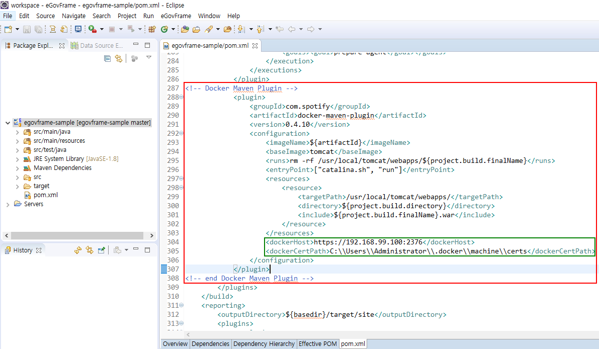
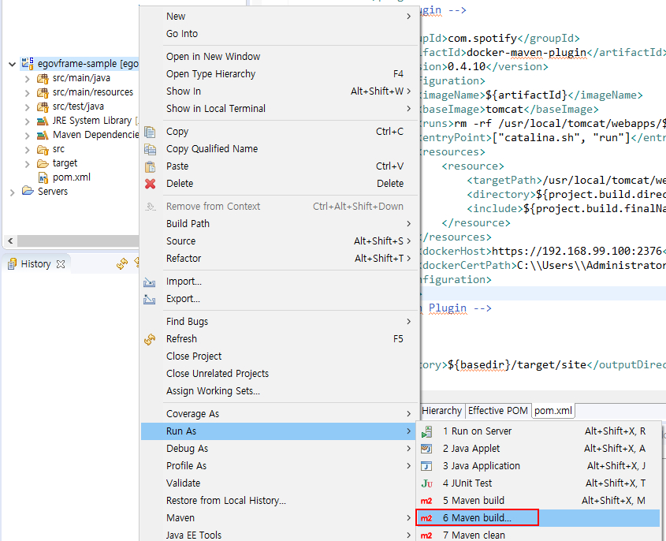
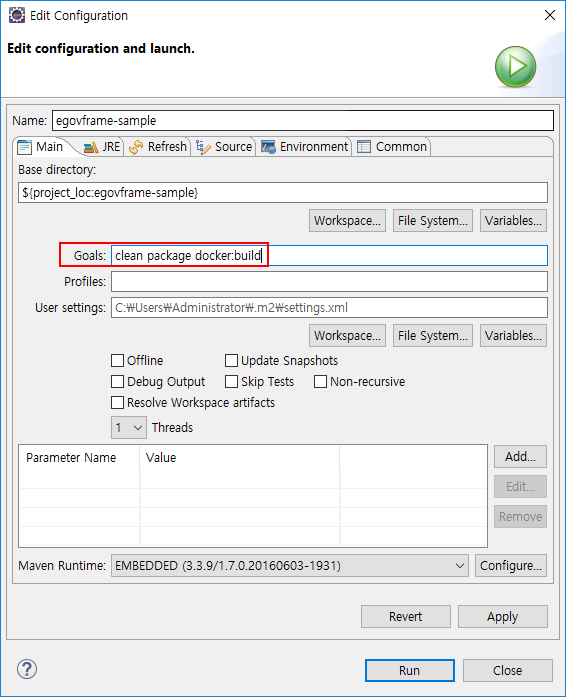
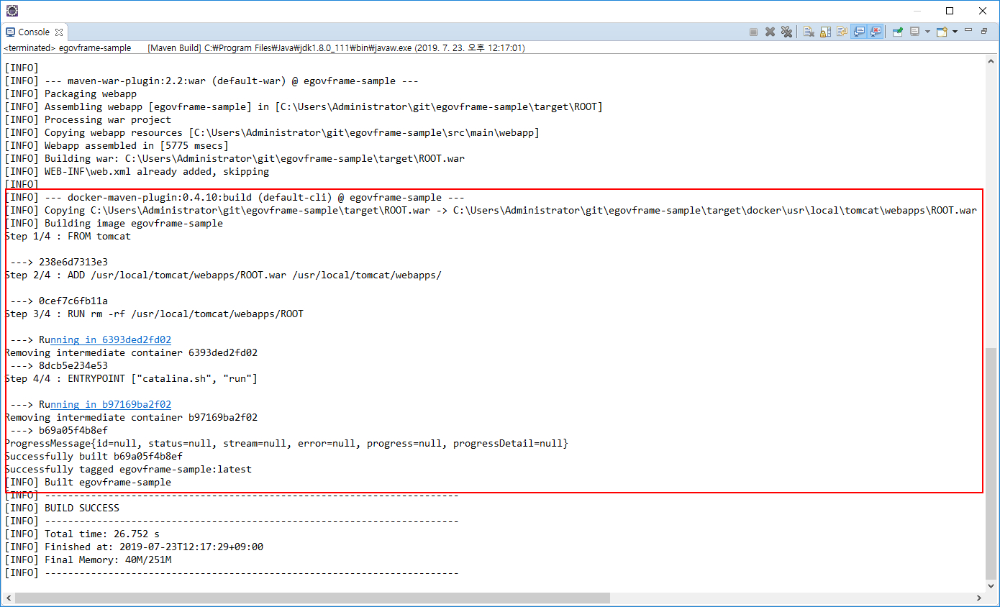

### 데스크톱에서 docker-maven-plugin 으로 이미지 빌드하기 ###
[https://www.egovframe.go.kr/wiki/doku.php?id=egovframework:dev3.6:dep:build_tool:docker](https://www.egovframe.go.kr/wiki/doku.php?id=egovframework:dev3.6:dep:build_tool:docker)  

#### Step1

#### Step2

#### Step3

#### Step4

